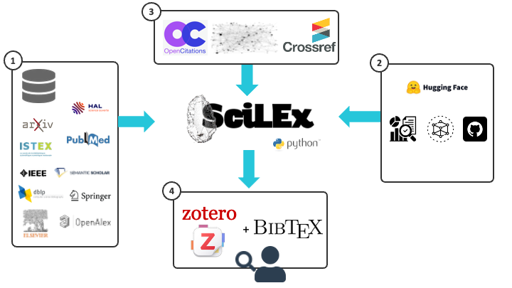

# SciLEx

[](https://scilex.readthedocs.io/en/latest/)
[](LICENSE)
[](https://www.python.org/)
[](https://github.com/Wimmics/SciLEx/issues)
[](https://github.com/Wimmics/SciLEx/actions/workflows/tests.yml)

**SciLEx** (Science Literature Exploration) is a Python toolkit for systematic literature reviews. Crawl 10 academic APIs, deduplicate papers, analyze citation networks, and push to Zotero with advanced quality filtering.


## Cite this work:

**Full text**:

Célian Ringwald, Benjamin Navet. SciLEx, Science Literature Exploration Toolkit ⟨swh:1:dir:944639eb0260a034a5cbf8766d5ee9b74ca85330⟩.

**Bibtex**:

```bibtex
@softwareversion{scilex2026,
  TITLE = {{SciLEx, Science Literature Exploration Toolkit}},
  AUTHOR = {Ringwald, Célian and Navey, Benjamin},
  URL = {https://github.com/Wimmics/SciLEx},
  NOTE = {},
  INSTITUTION = {{University C{\^o}te d'Azur ; CNRS ; Inria}},
  YEAR = {2026},
  MONTH = Fev,
  SWHID = {swh:1:dir:944639eb0260a034a5cbf8766d5ee9b74ca85330},
  VERSION = {1.0},
  REPOSITORY = {https://github.com/Wimmics/SciLEx},
  LICENSE = {MIT Licence},
  KEYWORDS = {Python, Scientific literature, literature research, paper retriva},
  HAL_ID = {},
  HAL_VERSION = {},
}
```

---
## Framework



---

## Key Features

- Multi-API collection with parallel processing (10 academic APIs)
- Smart deduplication using DOI, URL, and fuzzy title matching
- 5-phase quality filtering pipeline with time-aware citation thresholds
- Citation network extraction via CrossRef + OpenCitations + Semantic Scholar
- HuggingFace enrichment: ML models, datasets, GitHub stats, AI keywords
- Export to Zotero (bulk upload) or BibTeX (with PDF links)
- Idempotent collections for safe re-runs

---

## Installation

```bash
# With uv (recommended)
uv sync

# With pip
pip install -e .

# Dev dependencies (pytest, ruff, coverage)
pip install -e ".[dev]"
```

## Quick Start

```bash
# 1. Configure APIs and search parameters
cp scilex/api.config.yml.example scilex/api.config.yml
cp scilex/scilex.config.yml.example scilex/scilex.config.yml
cp scilex/scilex.advanced.yml.example scilex/scilex.advanced.yml

# 2. Collect papers from APIs
scilex-collect

# 3. Deduplicate & filter
scilex-aggregate

# 4. (Optional) Enrich with HuggingFace metadata
scilex-enrich

# 5. Export to Zotero or BibTeX
scilex-push-zotero          # Push to Zotero
scilex-export-bibtex        # Or export to BibTeX
```

See the [Quick Start Guide](https://scilex.readthedocs.io/en/latest/getting-started/quick-start.html) for a complete walkthrough.

---

## Supported APIs

| API | Key Required | Best For |
|-----|-------------|----------|
| **SemanticScholar** | Optional | CS/AI papers, citation networks |
| **OpenAlex** | Optional | Broad coverage, ORCID data |
| **IEEE** | Yes | Engineering, CS conferences |
| **Arxiv** | No | Preprints, physics, CS |
| **Springer** | Yes | Journals, books |
| **Elsevier** | Yes | Medical, life sciences |
| **PubMed** | Optional | 35M biomedical papers |
| **HAL** | No | French research, theses |
| **DBLP** | No | CS bibliography, 95%+ DOI |
| **Istex** | No | French institutional access |

See the [API Comparison](https://scilex.readthedocs.io/en/latest/reference/api-comparison.html) for rate limits, coverage details, and limitations.

---

## Documentation

Full documentation is available at **[scilex.readthedocs.io](https://scilex.readthedocs.io/en/latest/)**:

- [Installation](https://scilex.readthedocs.io/en/latest/getting-started/installation.html) - Setup with uv or pip
- [Configuration](https://scilex.readthedocs.io/en/latest/getting-started/configuration.html) - API keys, keywords, filters
- [Basic Workflow](https://scilex.readthedocs.io/en/latest/user-guides/basic-workflow.html) - Step-by-step pipeline guide
- [Advanced Filtering](https://scilex.readthedocs.io/en/latest/user-guides/advanced-filtering.html) - 5-phase filtering pipeline
- [BibTeX Export](https://scilex.readthedocs.io/en/latest/reference/bibtex-export.html) - Field reference, PDF sources
- [Troubleshooting](https://scilex.readthedocs.io/en/latest/getting-started/troubleshooting.html) - Common issues and fixes

---

## Contributing

- Report issues: [GitHub Issues](https://github.com/datalogism/SciLEx/issues)
- See [CONTRIBUTING.md](CONTRIBUTING.md) for development guidelines

## Requirements

- Python >=3.10
- pip or uv package manager
