# SciLEx

**SciLEx** (Science Literature Exploration) is a Python toolkit for systematic literature reviews. Crawl 9+ academic APIs, deduplicate papers, analyze citation networks, and push to Zotero with advanced quality filtering.


## Cite this work:

Either cite one of the papers above or cite the software itself as this with its SWHID:

**Full text**:

Célian Ringwald, Benjamin Navet. SciLEx, Science Literature Exploration Toolkit ⟨swh:1:dir:944639eb0260a034a5cbf8766d5ee9b74ca85330⟩. 

**Bibtex**:

```bibtex
@softwareversion{scilex2026,
  TITLE = {{SciLEx, Science Literature Exploration Toolkit}},
  AUTHOR = {Ringwald, Célian and Navey, Benjamin},
  URL = {https://github.com/Wimmics/SciLEx},
  NOTE = {},
  INSTITUTION = {{University C{\^o}te d'Azur ; CNRS ; Inria}},
  YEAR = {2026},
  MONTH = Fev,
  SWHID = {swh:1:dir:944639eb0260a034a5cbf8766d5ee9b74ca85330},
  VERSION = {1.0},
  REPOSITORY = {https://github.com/Wimmics/SciLEx},
  LICENSE = {MIT Licence},
  KEYWORDS = {Python, Scientific literature, literature research, paper retriva},
  HAL_ID = {},
  HAL_VERSION = {},
}
```

---

## Key Features

- Multi-API collection with parallel processing (SemanticScholar, OpenAlex, IEEE, Arxiv, Springer, HAL, DBLP, Istex, PubMed)
- Smart deduplication using DOI, URL, and fuzzy title matching
- Parallel aggregation with configurable workers (default mode)
- Citation network extraction via OpenCitations + Semantic Scholar with SQLite caching
- Quality filtering pipeline with time-aware citation thresholds, relevance ranking, and itemType filtering
- HuggingFace enrichment (NEW): Extract ML models, datasets, GitHub stats, and AI keywords
- Bulk Zotero upload in batches of 50 items
- Idempotent collections for safe re-runs (automatically skips completed queries)

---

## Installation

```bash
# Install with pip (or uv)
pip install -e .
# OR
uv pip install -e .

# For development (includes pytest, ruff)
pip install -e ".[dev]"
```

## Quick Start

```bash
# 1. Configure APIs and search parameters
cp scilex/api.config.yml.example scilex/api.config.yml
cp scilex/scilex.config.yml.example scilex/scilex.config.yml
cp scilex/scilex.advanced.yml.example scilex/scilex.advanced.yml

# Edit with your API keys and keywords

# 2. Main workflow (CLI commands)
scilex-collect                               # Collect papers from APIs
scilex-aggregate                             # Deduplicate & filter (parallel by default)

# 3. Optional: Enrich with HuggingFace metadata (BEFORE output)
scilex-enrich                                # Add ML models, datasets, GitHub stats

# 4. Output to Zotero or BibTeX
scilex-push-zotero                           # Push to Zotero (with HF tags if enriched)
# OR
scilex-export-bibtex                         # Export to BibTeX (with HF keywords)

# Alternative: use python -m
python -m scilex collect
python -m scilex aggregate
python -m scilex enrich
python -m scilex push-zotero
python -m scilex export-bibtex
```

---

## Core Commands

### Collection & Aggregation

```bash
# Basic collection
scilex-collect

# Aggregation with all features (default: parallel mode)
scilex-aggregate
# Optional flags:
#   --skip-citations: Skip citation fetching
#   --workers N: Citation workers (default: 3)
#   --parallel-workers N: Aggregation workers (default: auto)
#   --profile: Show performance stats
```

### Zotero Integration

```bash
scilex-push-zotero
```

### HuggingFace Enrichment (NEW)

```bash
# Full enrichment (enriches CSV before pushing to Zotero)
scilex-enrich

# Dry run (preview matches without updating)
scilex-enrich --dry-run --limit 10

# Process limited number of papers
scilex-enrich --limit 100
```

### Code Quality

```bash
# Format and lint
uvx ruff format .
uvx ruff check --fix .
```

---

## Supported APIs

| API | Key Required | Rate Limit | Abstract | Citations | Best For |
|-----|--------------|------------|----------|-----------|----------|
| **SemanticScholar** | Optional | 1/sec (100/page regular, 1000/page bulk) | ✓ | ✓ | CS/AI papers, citation networks |
| **OpenAlex** | No | 10/sec, 100k/day | ~60% | ✓ | Broad coverage, ORCID data |
| **IEEE** | Yes | 10/sec, 200/day | ✓ | ✓ | Engineering, CS conferences |
| **Arxiv** | No | 3/sec | ✓ | ✗ | Preprints, physics, CS |
| **Springer** | Yes | 1.5/sec | ✓ | Partial | Journals, books |
| **Elsevier** | Yes | 6/sec | Partial | ✓ | Medical, life sciences |
| **HAL** | No | 10/sec | ✓ | ✗ | French research, theses |
| **DBLP** | No | 10/sec | ✗ (copyright) | ✗ | CS bibliography, 95%+ DOI coverage |
| **Istex** | No | Conservative | ✓ | ✗ | French institutional access |

**Notes:**
- **SemanticScholar bulk mode**: 10x faster collection but requires higher-tier API access
- **DBLP**: No abstracts by design (copyright restrictions), but excellent bibliographic metadata
- Rate limits are configurable in `api.config.yml`

---

## BibTeX Export

Export aggregated papers to BibTeX format for LaTeX, Overleaf, and citation managers.

```bash
scilex-export-bibtex
```

**Output**: `output/collect_YYYYMMDD_HHMMSS/aggregated_results.bib`

### PDF Download Links

The `file` field contains **direct PDF download URLs** (~40-60% coverage, open-access only). This is different from `url` (publisher landing page):
- **`file`**: Direct PDF link for automated downloads (`https://arxiv.org/pdf/2307.03172.pdf`)
- **`url`**: Landing page requiring human interaction (`https://arxiv.org/abs/2307.03172`)

**PDF Sources by API:**

| API | PDF Availability | Source | Implementation |
|-----|------------------|--------|----------------|
| arXiv | ✅ Always (100%) | Constructed from ID | `https://arxiv.org/pdf/{id}.pdf` |
| SemanticScholar | ✅ Good (~60%) | `open_access_pdf` field | Includes bioRxiv, medRxiv, SSRN |
| OpenAlex | ✅ Good (~50%) | `best_oa_location.pdf_url` | DOAJ, PubMed Central, repos |
| HAL | ✅ Good (~70%) | `files_s` list | French institutional repos |
| IEEE | ⚠️ Rare (<5%) | `pdf_url` field | Requires subscription |
| Springer | ❌ Rarely | API provides no PDFs | Paywalled |
| Elsevier | ❌ Rarely | API provides no PDFs | Paywalled |

### BibTeX Fields Summary

| Field Category | Fields | Notes |
|----------------|--------|-------|
| **Core** | title, author, year, journal/booktitle, volume, number, pages | Standard bibliographic data |
| **Links** | `file` (PDF URL), `url` (landing page) | file ~40-60% coverage, url ~95% |
| **Identifiers** | doi, abstract, language, copyright | Full abstracts (no truncation) |
| **Source** | archiveprefix (API), eprint (API ID) | Track data provenance |
| **HF Enrichment** | keywords, note (HF URL), howpublished (GitHub) | Optional, after `enrich_with_hf.py` |

**Entry Types**: journalArticle → @article, conferencePaper → @inproceedings, book → @book, bookSection → @incollection, preprint → @misc

---

## Aggregation Pipeline Overview

The aggregation step transforms raw API results into a curated, high-quality dataset. From **200,000 raw papers** down to **500 final papers** (99.75% reduction).

```mermaid
flowchart TB
    A[("🔍 9 APIs<br/>200,000 papers")] --> B
    B["⚡ Deduplication<br/>-160,000 duplicates"] --> C
    C[("📄 40,000 unique")] --> D
    D["📋 ItemType Filter<br/>-5,000 invalid types"] --> E
    E[("📄 35,000 valid")] --> F
    F["🔑 Keyword Filter<br/>-20,000 no match"] --> G
    G[("📄 15,000 matched")] --> H
    H["✅ Quality Filter<br/>-7,000 low quality"] --> I
    I[("📄 8,000 quality")] --> J
    J["📊 Citation Filter<br/>-6,000 low citations"] --> K
    K[("📄 2,000 cited")] --> L
    L["🏆 Relevance Ranking<br/>Top 500 selected"] --> M
    M[("✨ 500 Final Papers")]

    style A fill:#e1f5fe
    style M fill:#c8e6c9
    style B fill:#ffecb3
    style D fill:#ffecb3
    style F fill:#ffecb3
    style H fill:#ffecb3
    style J fill:#ffecb3
    style L fill:#ffecb3
```



### Pipeline Stages Explained

| Stage | Papers In | Removed | Papers Out | Description |
|-------|-----------|---------|------------|-------------|
| **API Collection** | - | - | 200,000 | Raw results from 10 academic APIs |
| **Deduplication** | 200,000 | 160,000 (80%) | 40,000 | Merge duplicates via DOI + fuzzy title matching |
| **ItemType Filter** | 40,000 | 5,000 | 35,000 | Keep only valid types |
| **Keyword Filter** | 35,000 | 20,000 | 15,000 | Enforce dual-group keyword matching |
| **Quality Filter** | 15,000 | 7,000 | 8,000 | Score metadata completeness |
| **Citation Filter** | 8,000 | 6,000 | 2,000 | Time-aware citation thresholds |
| **Relevance Ranking** | 2,000 | 1,500 | **500** | Select top papers by composite score |

### Stage Details

#### 1. Deduplication (80% reduction)
The same paper often appears in multiple APIs. Deduplication merges them using:
- **DOI matching**: Exact match on Digital Object Identifier
- **URL matching**: Same canonical URL
- **Fuzzy title matching**: Similar titles (handles minor variations)

When merging, the best metadata from each source is preserved.

#### 2. ItemType Filter
Removes non-research content by keeping only:
- `journalArticle` — Peer-reviewed journal papers
- `conferencePaper` — Conference proceedings
- `book` — Complete books
- `bookSection` — Book chapters

Filters out: datasets, software, blog posts, news articles, patents, etc.

#### 3. Keyword Filter (Dual-Group Mode)
When configured with two keyword groups, papers must match **BOTH** groups in their **title or abstract**:
```yaml
keywords:
  - ["machine learning", "deep learning", "neural network"]  # Group 1: Method
  - ["medical", "healthcare", "clinical"]                     # Group 2: Domain
```
The filter combines title + abstract text and checks for keyword presence (case-insensitive). A paper needs at least one match from each group. Example: a paper titled "Deep Learning for Medical Diagnosis" passes (matches "deep learning" from Group 1 and "medical" from Group 2).

#### 4. Quality Filter
Scores metadata completeness with weighted fields:
- **DOI** (high weight): Enables citation lookup and deduplication
- **Title** (high weight): Essential for identification
- **Authors** (high weight): Attribution and filtering
- **Abstract** (medium weight): Content understanding
- **Year, Journal** (lower weight): Supplementary metadata

Papers below the quality threshold are removed.

#### 5. Citation Filter (Time-Aware)
Applies graduated citation requirements based on paper age:

| Paper Age | Min Citations | Rationale |
|-----------|---------------|-----------|
| 0-18 months | 0 | Grace period for new papers |
| 18-24 months | 1-3 | Early citations emerging |
| 24-36 months | 5-8 | Should have some impact |
| 36+ months | 10+ | Established papers only |

This prevents penalizing recent papers while filtering out older papers that never gained traction.

#### 6. Relevance Ranking
Final scoring combines multiple signals:
- **Keyword relevance** (45%): How well the paper matches search terms
- **Quality score** (25%): Metadata completeness
- **ItemType bonus** (20%): Journal articles and conference papers ranked higher
- **Citation score** (10%): Normalized citation count

The top N papers (configurable, default 500) are selected for the final output.

---

## Advanced Features

### Quality Filtering Pipeline

1. **ItemType filtering** (whitelist mode): Keep only journalArticle, conferencePaper, book, bookSection
2. **Dual keyword enforcement**: Papers must match keywords from BOTH groups (if dual-group mode configured)
3. **Abstract quality scoring**: Metadata completeness (DOI, title, authors weighted higher)
4. **Time-aware citation filtering**:
   - 0-18 months: 0 citations required (grace period)
   - 18-21 months: 1+ citation
   - 21-24 months: 3+ citations
   - 24-36 months: 5-8+ citations (gradual increase)
   - 36+ months: 10+ citations (established papers)
5. **Relevance ranking**: Composite score (keywords 45%, quality 25%, itemType 20%, citations 10%)

### Performance Optimizations

- Parallel aggregation (default mode, configurable workers)
- SQLite citation caching with 30-day TTL
- Circuit breaker pattern for failed API endpoints
- Bulk Zotero upload in batches of 50 items

### HuggingFace Enrichment

- Fuzzy title matching with 85% threshold
- Extracts: TASK, PTM (pre-trained models), ARCHI, DATASET, FRAMEWORK, GITHUB_STARS
- Updates Zotero fields: `archive` (HF URL), `archiveLocation` (GitHub repo)
- Match rate: 30-50%, with SQLite caching (30-day TTL)

---

## Configuration

### `scilex/scilex.config.yml` - Collection Parameters

- **`keywords`**: Single or dual group mode
  - Single: `[["term1", "term2"], []]` (ANY match)
  - Dual: `[["group1"], ["group2"]]` (AND logic between groups)
- **`years`**: List of years to search (e.g., [2020, 2021, 2022, 2023, 2024])
- **`apis`**: Which APIs to query (e.g., ['SemanticScholar', 'IEEE', 'OpenAlex'])
- **`semantic_scholar_mode`**: "regular" (100/page) or "bulk" (1000/page)
- **`aggregate_get_citations`**: Enable automatic citation fetching
- **`quality_filters`**: Relevance weights, max_papers limit, citation thresholds

### `scilex/api.config.yml` - API Credentials

- **Zotero**: `api_key`, `user_id`, `collection_id`
- **IEEE, Elsevier, Springer**: `api_key` (required)
- **SemanticScholar, HuggingFace**: `token` (optional, improves rate limits)
- **`rate_limits`**: Per-API request limits (configurable)

---

## Documentation & Contributing

- **Output structure**: `output/collect_YYYYMMDD_HHMMSS/` with timestamped collections
- **Idempotent design**: Safe re-runs automatically skip completed queries
- **Built for**: Systematic reviews in AI/ML research (PhD context)

### Contributing

- Report issues: [GitHub Issues](https://github.com/datalogism/SciLEx/issues)

### Requirements

- Python >=3.10
- pip or uv package manager
