# Advanced Filtering Guide

SciLEx applies a 5-phase filtering pipeline that transforms raw API results into a curated, high-quality dataset. From **200,000 raw papers** down to **500 final papers** (99.75% reduction).

## Pipeline Overview

```mermaid
flowchart TB
    A[("🔍 10 APIs<br/>200,000 papers")] --> B
    B["⚡ Deduplication<br/>-160,000 duplicates"] --> C
    C[("📄 40,000 unique")] --> D
    D["📋 ItemType Filter<br/>-5,000 invalid types"] --> E
    E[("📄 35,000 valid")] --> F
    F["🔑 Keyword Filter<br/>-20,000 no match"] --> G
    G[("📄 15,000 matched")] --> H
    H["✅ Quality Filter<br/>-7,000 low quality"] --> I
    I[("📄 8,000 quality")] --> J
    J["📊 Citation Filter<br/>-6,000 low citations"] --> K
    K[("📄 2,000 cited")] --> L
    L["🏆 Relevance Ranking<br/>Top 500 selected"] --> M
    M[("✨ 500 Final Papers")]

    style A fill:#e1f5fe
    style M fill:#c8e6c9
    style B fill:#ffecb3
    style D fill:#ffecb3
    style F fill:#ffecb3
    style H fill:#ffecb3
    style J fill:#ffecb3
    style L fill:#ffecb3
```



| Stage | Papers In | Removed | Papers Out | Description |
|-------|-----------|---------|------------|-------------|
| **API Collection** | — | — | 200,000 | Raw results from 10 academic APIs |
| **Deduplication** | 200,000 | 160,000 (80%) | 40,000 | Merge duplicates via DOI + fuzzy title matching |
| **ItemType Filter** | 40,000 | 5,000 | 35,000 | Keep only valid publication types |
| **Keyword Filter** | 35,000 | 20,000 | 15,000 | Enforce dual-group keyword matching |
| **Quality Filter** | 15,000 | 7,000 | 8,000 | Score metadata completeness |
| **Citation Filter** | 8,000 | 6,000 | 2,000 | Time-aware citation thresholds |
| **Relevance Ranking** | 2,000 | 1,500 | **500** | Select top papers by composite score |

## Filtering Phases

1. **ItemType Filter** - Keep specific publication types
2. **Keyword Match** - Verify search term relevance
3. **Quality Score** - Check metadata completeness
4. **Citation Filter** - Time-aware citation thresholds
5. **Relevance Rank** - Score and limit to top N papers

## Phase 1: ItemType Filtering

Keep only specific publication types.

```yaml
quality_filters:
  enable_itemtype_filter: true
  allowed_item_types:
    - journalArticle
    - conferencePaper
    - bookSection
    - book
```

Common types:
- `journalArticle` - Peer-reviewed journals
- `conferencePaper` - Conference proceedings
- `book` - Academic books
- `bookSection` - Book chapters
- `preprint` - Pre-publication
- `thesis` - Dissertations
- `report` - Technical reports

## Phase 2: Keyword Matching

### Single Group (OR Logic)

Papers match ANY keyword:

```yaml
keywords:
  - ["neural network", "deep learning", "CNN"]
  - []  # Empty
```

### Dual Group (AND Logic)

Papers must match at least one from EACH group:

```yaml
keywords:
  - ["climate", "weather"]         # Topic
  - ["prediction", "forecast"]     # Method
```

### Bonus Keywords (Relevance Boost)

Papers matching bonus keywords get higher relevance scores (0.5x weight) but are never excluded:

```yaml
bonus_keywords:
  - "temporal reasoning"
  - "multi-hop"
```

## Phase 3: Quality Scoring

This phase applies two independent scoring mechanisms:

### 3a. Metadata Completeness Score

Scores how complete a paper's metadata is, using weighted fields:

- **Critical fields** (5 pts each): DOI, title, authors, date
- **Important fields** (3 pts each): abstract, journal, volume, issue, publisher
- **All other fields** (1 pt each): pages, URL, language, rights, etc.
- **Bonus**: +1 point if both volume and issue are present

The score is open-ended (typically 0-50) and is used as one component
of the [relevance ranking](#phase-5-relevance-ranking) (25% weight by default).
It does not directly filter papers.

### 3b. Abstract Quality Score

Separately, abstracts are validated for content quality on a 0-100 scale.
The score starts at 100 and deducts points for detected issues:

| Issue | Severity | Deduction | Example |
|-------|----------|-----------|---------|
| Truncated text | Critical | -40 pts | Ends with "..." or cut-off mid-sentence |
| Missing/empty | Critical | -40 pts | No abstract available |
| Boilerplate text | Warning | -15 pts | Generic publisher placeholder |
| Too short | Warning | -15 pts | Under 50 words |
| Too long | Warning | -15 pts | Over 1000 words (likely full text) |
| Incomplete sentence | Warning | -15 pts | Ends with preposition/conjunction |
| Formatting issues | Info | -5 pts | Minor formatting problems |

Papers below the threshold (default: 60) are removed:

```yaml
quality_filters:
  validate_abstracts: true             # Validate and filter poor abstracts
  min_abstract_quality_score: 60       # 0-100 scale (default: 60)
```

## Phase 4: Citation Filtering

Time-aware thresholds based on paper age (from `config_defaults.py`):

- 0-18 months: 0 citations required (grace period)
- 18-21 months: 1+ required
- 21-24 months: 3+ required
- 24-36 months: 5-8+ required (gradual increase)
- 36+ months: 10+ required

```yaml
aggregate_get_citations: true
quality_filters:
  apply_citation_filter: true
```

## Phase 5: Relevance Ranking

Composite score combining:
- Keyword frequency (45%)
- Metadata quality (25%)
- Publication type (20%)
- Citation impact (10%)

```yaml
quality_filters:
  apply_relevance_ranking: true
  max_papers: 500  # Keep top 500

  relevance_weights:
    keywords: 0.45
    quality: 0.25
    itemtype: 0.20
    citations: 0.10
```

## Complete Configuration

```yaml
keywords:
  - ["explainable AI", "XAI"]
  - ["healthcare", "medical"]

bonus_keywords: ["interpretability", "transparency"]

years: [2022, 2023, 2024]

apis:
  - SemanticScholar
  - OpenAlex

aggregate_get_citations: true   # Top-level key (not under quality_filters)

quality_filters:
  # Phase 1
  enable_itemtype_filter: true
  allowed_item_types:
    - journalArticle
    - conferencePaper

  # Phase 3
  validate_abstracts: true
  min_abstract_quality_score: 60

  # Phase 4
  apply_citation_filter: true

  # Phase 5
  apply_relevance_ranking: true
  max_papers: 300

  relevance_weights:
    keywords: 0.45
    quality: 0.25
    itemtype: 0.20
    citations: 0.10
```

## Monitoring

Check the aggregation report:

```
Initial papers: 10,000
After ItemType: 7,000
After Keywords: 4,200
After Quality: 3,360
After Citations: 2,352
After Relevance: 300
```

## Troubleshooting

### Too Few Papers?

1. Relax keyword restrictions (use single group mode)
2. Lower quality thresholds
3. Disable citation filter

```yaml
quality_filters:
  apply_citation_filter: false
  min_abstract_quality_score: 40
```

### Too Many Papers?

1. Use dual keyword groups (AND logic)
2. Enable all filters
3. Set lower `max_papers` limit

### Check Results

```python
import pandas as pd

df = pd.read_csv('aggregated_data.csv')

# Check scores
top = df.nlargest(10, 'relevance_score')
print(top[['title', 'relevance_score', 'quality_score', 'citation_count']])
```

## See Also

- [Basic Workflow](basic-workflow.md) — Step-by-step pipeline guide
- [Configuration](../getting-started/configuration.md) — Filter configuration reference
- [Troubleshooting](../getting-started/troubleshooting.md) — Common issues and fixes